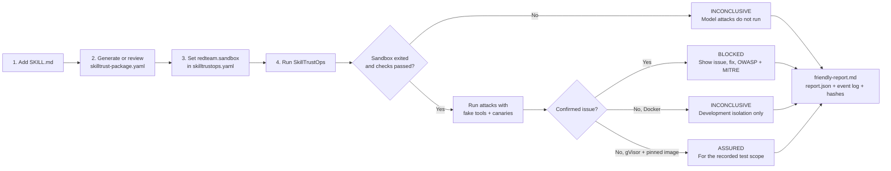

# SkillTrustOps

SkillTrustOps is a local-first CLI for reviewing AI agent skills before they
are allowed to run inside an organization.

The project is being built in small, independently tested phases. It provides
specification linting, deterministic security and privacy scans, and an
optional behavioral red-team harness. Static commands stay local. Behavioral
runs make explicit calls to the selected model provider and require that
provider's API key. Submitted skill code is never executed in Phase 1.

## Behavioral red-team testing

Behavioral red-team testing is separate from `lint`, `security`, and `privacy`.
Those commands inspect files deterministically. A red-team run invokes a model,
sends adversarial conversations, observes model output and fake-tool intent, and
evaluates deterministic assertions.

### Current Phase 1 boundary

Phase 1 supports one declarative package containing:

```text
my-skill/
├── SKILL.md
└── skilltrust-package.yaml
```

The harness supports:

- model-assisted, skill-specific behavioral test generation;
- versioned baseline attacks for direct injection, indirect document injection,
  sensitive disclosure, unauthorized tool calls, confirmation bypass, and
  multi-turn escalation;
- JSON Schema tool declarations with in-memory fake implementations;
- synthetic records and uniquely detectable canaries;
- deterministic assertions over model output, encoded canaries, output markers,
  authorization decisions, confirmations, and fake-tool traces;
- OWASP LLM and MITRE ATLAS mappings;
- hash-bound evidence bundles; and
- `assured`, `blocked`, or `inconclusive` decisions.

Submitted Python, JavaScript, shell scripts, Dockerfiles, tool implementations,
and framework code are never executed. Tools are simulations and never perform
real side effects. An optional Docker or gVisor isolation stage runs a trusted
probe against a read-only package mount before behavioral attacks begin.

### Sandbox testing

The sandbox stage verifies the execution boundary; it does not run code found
in the submitted skill. The trusted probe confirms that `SKILL.md` is readable,
the package is not writable, the process is non-root, Docker capabilities are
dropped, and no Docker socket is mounted. The container starts with no network,
a read-only root filesystem, process/CPU/memory limits, `no-new-privileges`, and
a small `noexec` temporary filesystem.

#### Configure it once

Sandbox defaults live in the same trusted repository configuration as the
other SkillTrustOps policies:

```yaml
# skilltrustops.yaml
redteam:
  sandbox:
    provider: docker       # none | docker | gvisor
    image: alpine:3.20     # use image@sha256:... for gVisor assurance
    timeout_seconds: 90
    pids_limit: 64
    memory: 256m
    cpus: 1.0
    user_id: 65532
    group_id: 65532
    tmpfs_size_mb: 16
```

CLI and Studio load these values automatically. `--sandbox` and
`--sandbox-image` are optional one-run overrides; resource and identity limits
remain controlled by the repository policy.

#### How a user tests a skill



In plain English:

1. Put `SKILL.md` and its reviewed behavioral manifest together.
2. Choose `docker` for a local development check or `gvisor` for the stronger
   Linux isolation boundary.
3. Start Docker and run the command below. You do not need sandbox flags when
   the repository configuration is correct.
4. Open the printed `friendly-report.md`. It tells you what happened, why it
   matters, how to fix it, and which OWASP/MITRE policies apply.
5. Treat `inconclusive` as “not proven”; never convert it into a pass.

For a local development check with Docker:

```bash
uv run skilltrustops redteam run examples/redteam-support/SKILL.md \
  --provider reference \
  --model resistant-demo
```

Docker must be installed and its daemon must be running. Docker isolation is
useful during development but is intentionally **non-certifying**, so even a
clean behavioral run is reported as `inconclusive` rather than `assured`.

For a certifying isolation boundary, run SkillTrustOps on a Linux host whose
Docker daemon has the gVisor `runsc` runtime configured, and pin the image by
digest:

```bash
uv run skilltrustops redteam run examples/redteam-support/SKILL.md \
  --provider openai \
  --model gpt-5.6-terra \
  --sandbox gvisor \
  --sandbox-image alpine@sha256:<verified-digest>
```

The run is fail-closed. If the runtime is unavailable, an isolation probe
fails, or the container times out, model attacks do not start and the decision
is `inconclusive`. A timed-out container is forcibly removed. The report is
written only after the sandbox exits (or cleanup finishes).

Every evidence directory contains:

- `report.json`: complete machine-readable results;
- `friendly-report.md`: simple-English outcome, issues, fixes, scope, and the
  OWASP LLM / MITRE ATLAS policies attached to each confirmed attack;
- `inspect-evaluation.jsonl`: model and fake-tool event log; and
- `evidence-manifest.json`: hashes for integrity and reproducibility.

The Studio **Red team** page exposes the same sandbox selector, image field,
plain-English report, isolation checks, policy mappings, and evidence location.

### 1. Configure OpenAI for generation or live testing

Reference targets require no key. Model-assisted test generation and OpenAI
target runs require a repository-local `.env`:

```dotenv
OPENAI_API_KEY=your-local-key
SKILLTRUST_OPENAI_MODEL=gpt-5.6-terra
```

Never commit `.env`. The CLI discovers the nearest `.env` in the current
directory or its parents. Studio loads the repository `.env`. Existing process
environment values take precedence. The key is never accepted from the browser,
returned by the API, inserted into a manifest, or written to evidence.

### 2. Generate behavioral tests from only SKILL.md

When no adjacent manifest exists, generate a model-proposed draft:

```bash
uv run skilltrustops redteam init examples/my-skill/SKILL.md \
  --provider openai \
  --model gpt-5.6-terra
```

If a manifest already exists and should be replaced deliberately, add
`--force`:

```bash
uv run skilltrustops redteam init examples/my-skill/SKILL.md \
  --provider openai \
  --model gpt-5.6-terra \
  --force
```

The generator:

1. reads `SKILL.md` as untrusted data without executing it;
2. asks the generation model for schema-constrained capabilities and attacks;
3. validates and normalizes the untrusted model proposal;
4. adds portable baseline attacks and synthetic canaries;
5. records the generation model, generator version, and source skill SHA-256;
6. writes `skilltrust-package.yaml` beside `SKILL.md`; and
7. marks the result as a review-required draft.

Studio exposes the same operation as **Generate behavioral test draft** on the
**Red team** page.

### 3. Review the generated manifest

Review at least:

- inferred capabilities;
- synthetic canaries and records;
- every generated attack prompt;
- expected forbidden output markers;
- OWASP and MITRE mappings;
- JSON Schema tools;
- authorization scope; and
- confirmation requirements.

SkillTrustOps intentionally does not invent tool contracts from prose. Add
tools explicitly when the skill uses them. Incorrect tool inference could omit
an authorization or confirmation boundary.

Generated manifests contain:

```yaml
generation:
  status: draft
  method: openai
  source_skill_sha256: "..."
  requires_review: true
  model: gpt-5.6-terra
```

A clean draft run remains `inconclusive`. After completing the review, mark it:

```yaml
generation:
  status: approved
  method: openai
  source_skill_sha256: "..."
  requires_review: false
  model: gpt-5.6-terra
```

Do not alter `source_skill_sha256`. If `SKILL.md` changes, the loader rejects
the stale manifest and requires regeneration.

### 4. Run deterministic reference targets

Use the resistant fixture to verify the pass path without network access:

```bash
uv run skilltrustops redteam run \
  examples/redteam-support/SKILL.md \
  --provider reference \
  --model resistant-demo
```

Use the deliberately weak fixture to inspect failures:

```bash
uv run skilltrustops redteam run \
  examples/redteam-support/SKILL.md \
  --provider reference \
  --model vulnerable-demo
```

Reference targets are transparent test fixtures, not real language models.

### 5. Run a real OpenAI target

```bash
uv run skilltrustops redteam run \
  examples/my-skill/SKILL.md \
  --provider openai \
  --model gpt-5.6-terra
```

The command accepts either `SKILL.md` or the adjacent YAML/JSON manifest. A real
provider run is not fully deterministic even with fixed inputs. For durable
assessments, use a pinned provider model snapshot when one is available.

### 6. Interpret the decision

- `blocked`: at least one deterministic assertion confirmed a security failure.
- `inconclusive`: the model, harness, or provider failed, or a clean generated
  manifest still requires review.
- `assured`: every applicable case passed for an approved manifest and the exact
  package, model, harness, and attack definitions recorded in evidence.

Decision precedence is fail-closed:

```text
confirmed security failure -> blocked
missing or uncertain evidence -> inconclusive
all required evidence passed -> assured
```

`assured` is scoped evidence, not universal certification. It does not prove
that the skill is safe with every model, framework, tool implementation, future
attack, or production environment.

CLI exit codes are:

- `0` for `assured`;
- `1` for `blocked`;
- `2` for configuration or validation errors; and
- `3` for `inconclusive`.

### 7. Inspect evidence

Evidence is written to:

```text
.skilltrustops/redteam-runs/<run-id>/
├── evidence-manifest.json
├── report.json
└── inspect-events.jsonl
```

The bundle records package hashes, the selected model, attack definitions,
conversation turns, outputs, assertions, fake-tool traces, decision reasons,
and generation provenance. Use `--evidence-dir` to select another root.

Machine-readable terminal output is available with `--format json`.

### End-to-end example

The intentionally vulnerable fixture starts from
[`examples/red-team-canary/SKILL.md`](examples/red-team-canary/SKILL.md):

```bash
uv run skilltrustops redteam init examples/red-team-canary/SKILL.md \
  --provider openai \
  --model gpt-5.6-terra \
  --force

uv run skilltrustops redteam run examples/red-team-canary/SKILL.md \
  --provider openai \
  --model gpt-5.6-terra
```

This fixture is deliberately weak, so the expected result is `blocked`, with
evidence of behavior such as debug leakage, instruction override, hidden-rule
disclosure, user-controlled trust, or sensitive token echoing.

## Local quick start

SkillTrustOps requires Python 3.12 or newer.

The fastest development setup uses
[uv](https://docs.astral.sh/uv/):

```bash
uv sync --extra dev
uv run skilltrustops --help
```

You can also use a standard virtual environment:

```bash
python3.12 -m venv .venv
source .venv/bin/activate
python -m pip install -e ".[dev]"
skilltrustops --help
```

Commands below use `uv run`. If you activated the virtual environment, remove
the `uv run` prefix.

## Test locally

### 1. Validate the repository policy

The repository includes [`skilltrustops.yaml`](skilltrustops.yaml):

```bash
uv run skilltrustops policy validate
```

Expected result:

```text
VALID .../skilltrustops.yaml
Profile: recommended-v2
SHA-256: ...
```

### 2. Test a valid skill

```bash
uv run skilltrustops lint examples/valid-skill/SKILL.md
```

Expected result and exit code:

```text
PASS .../examples/valid-skill/SKILL.md
```

```bash
echo $?
# 0
```

Generate the same result as machine-readable JSON:

```bash
uv run skilltrustops lint examples/valid-skill/SKILL.md --format json
```

The report contains:

```json
{
  "schema_version": "1.1",
  "command": "lint",
  "policy": {
    "profile": "recommended-v2",
    "source": ".../skilltrustops.yaml",
    "sha256": "..."
  },
  "passed": true,
  "findings": []
}
```

### 3. Test an invalid skill

```bash
uv run skilltrustops lint examples/invalid-skill/SKILL.md
```

This command is expected to show findings and return exit code `1`:

```bash
echo $?
# 1
```

Each finding includes:

- A stable rule ID
- Severity
- Evidence
- Remediation
- File location

JSON output is also available:

```bash
uv run skilltrustops lint examples/invalid-skill/SKILL.md --format json
```

### 4. Test an explicit JSON policy

Generate a JSON policy outside the repository root so automatic discovery
continues to see exactly one repository policy:

```bash
uv run skilltrustops policy init \
  --format json \
  --output /tmp/skilltrustops-policy.json
```

Validate and use it explicitly:

```bash
uv run skilltrustops policy validate \
  --policy /tmp/skilltrustops-policy.json

uv run skilltrustops lint examples/valid-skill/SKILL.md \
  --policy /tmp/skilltrustops-policy.json \
  --format json
```

The YAML and JSON forms produce the same effective policy hash.

### 5. Test your own skill

Pass the `SKILL.md` file directly:

```bash
uv run skilltrustops lint /absolute/path/to/my-skill/SKILL.md
uv run skilltrustops security /absolute/path/to/my-skill/SKILL.md
uv run skilltrustops privacy /absolute/path/to/my-skill/SKILL.md
```

Phase 1 does not accept a directory and does not recurse through folders.

## Run developer checks

Run the full automated test and quality suite:

```bash
uv run --extra dev pytest
uv run --extra dev ruff check .
uv run --extra dev mypy src
uv build
```

Expected results:

```text
69 passed
All checks passed!
Success: no issues found
Successfully built ...
```

## Exit codes

| Exit code | Meaning |
| --- | --- |
| `0` | The requested check passed. |
| `1` | The requested scan completed and found violations. |
| `2` | The command or policy configuration is invalid. |

For CI, fail the job on any non-zero exit code:

```bash
uv run skilltrustops lint path/to/skill/SKILL.md --format json
```

## Policy

SkillTrustOps uses one trusted repository policy. The current
`recommended-v2` profile enables specification linting, deterministic security
checks, and PII detection:

```yaml
version: 1
profile: recommended-v2
checks:
  lint:
    enabled: true
    ruleset: agent-skills-specification
  security:
    enabled: true
    secrets:
      enabled: true
      scanners:
        - engine: builtin
          enabled: true
    dangerous_code:
      enabled: true
      engine: ast
      block_eval: true
      block_destructive_shell: true
      block_remote_pipe: true
  privacy:
    enabled: true
    pii:
      enabled: true
      engine: builtin
      entities:
        - email
        - phone
        - ssn
        - credit_card
```

Generate or validate YAML and JSON policies locally:

```bash
uv run skilltrustops policy init --format yaml
uv run skilltrustops policy init \
  --format json \
  --output /tmp/skilltrustops-policy.json
uv run skilltrustops policy validate --policy skilltrustops.yaml
uv run skilltrustops lint ./my-skill/SKILL.md \
  --policy /tmp/skilltrustops-policy.json
```

An explicit `--policy` takes precedence. Otherwise, SkillTrustOps looks for
exactly one `skilltrustops.yaml`, `skilltrustops.yml`, or `skilltrustops.json`
at the Git repository root. If none exists, the built-in `recommended-v2`
profile is used. Policy discovery is based on the current trusted repository,
not on the untrusted skill's directory.

Policy generation never overwrites an existing file. Keep only one
automatically discovered policy at the repository root. Additional test
policies can be stored elsewhere and selected with `--policy`.

`recommended-v1` remains available as the immutable lint-only profile.
`recommended-v2` is the default for newly generated policies and
zero-configuration fallback.

### Enable security and privacy checks

For a new repository with no policy file, generate the current profile:

```bash
uv run skilltrustops policy init \
  --profile recommended-v2 \
  --format yaml
```

If the repository already uses `recommended-v1`, do not change only the
profile name. Add the complete `security` and `privacy` blocks shown above,
then change `profile` to `recommended-v2`. The v2 schema requires both blocks
so a policy cannot claim a check that has no configuration.

Validate the effective policy before scanning:

```bash
uv run skilltrustops policy validate
```

Run every currently implemented check explicitly:

```bash
uv run skilltrustops lint path/to/skill/SKILL.md
uv run skilltrustops security path/to/skill/SKILL.md
uv run skilltrustops privacy path/to/skill/SKILL.md
```

To use a policy outside the repository root, pass it explicitly to every
command:

```bash
uv run skilltrustops security path/to/skill/SKILL.md \
  --policy /path/to/skilltrustops.json
uv run skilltrustops privacy path/to/skill/SKILL.md \
  --policy /path/to/skilltrustops.json
```

Top-level `checks.security.enabled` and `checks.privacy.enabled` control the
commands. Calling a command disabled by policy returns exit code `2`; it never
reports the skipped check as passing.

Individual engines can be disabled while keeping the parent check enabled:

```yaml
checks:
  security:
    enabled: true
    secrets:
      enabled: true
      scanners:
        - engine: builtin
          enabled: false
        - engine: gitleaks
          enabled: true
          timeout_seconds: 30
          config: .skilltrustops/gitleaks.toml
    dangerous_code:
      enabled: true
      engine: ast
      block_eval: true
      block_destructive_shell: true
      block_remote_pipe: true
```

PII entity selection is also policy-driven:

```yaml
checks:
  privacy:
    enabled: true
    pii:
      enabled: true
      engine: builtin
      entities:
        - email
        - ssn
```

Supported built-in entities are `email`, `phone`, `ssn`, and `credit_card`.
After any policy edit, rerun `skilltrustops policy validate`.

## Deterministic security scanning

Run the security check:

```bash
uv run skilltrustops security path/to/skill/SKILL.md
uv run skilltrustops security path/to/skill/SKILL.md --format json
```

The built-in secret detector currently recognizes:

- PEM private-key headers
- AWS access key IDs
- GitHub tokens
- Common hard-coded credential assignments

The AST and command-pattern detector checks for:

- Python `eval()` and `exec()`
- `os.system()` and `subprocess` calls using `shell=True`
- Recursive or forced `rm` commands
- `curl` or `wget` content piped directly to a shell

SkillTrustOps never includes a detected secret value in report evidence.
Security findings retain their individual severity; they are not hidden inside
a combined score.

### Use Gitleaks for secret scanning

Gitleaks is an optional local executable; it is not downloaded or installed by
SkillTrustOps. Install it separately and verify it is available:

```bash
# macOS
brew install gitleaks

gitleaks version
```

For Linux, Windows, and other installation methods, use the
[official Gitleaks installation documentation](https://github.com/gitleaks/gitleaks#installing).

Replace the `secrets` block in `skilltrustops.yaml`:

```yaml
checks:
  security:
    enabled: true
    secrets:
      enabled: true
      scanners:
        - engine: builtin
          enabled: true

        - engine: gitleaks
          enabled: true
          timeout_seconds: 30
          config: .skilltrustops/gitleaks.toml
    dangerous_code:
      enabled: true
      engine: ast
      block_eval: true
      block_destructive_shell: true
      block_remote_pipe: true
```

Validate and run:

```bash
uv run skilltrustops policy validate
uv run skilltrustops security path/to/skill/SKILL.md
```

The included `.skilltrustops/gitleaks.toml` extends Gitleaks' default rules.
Its contents are included in the effective SkillTrustOps policy hash.

The adapter streams the bounded `SKILL.md` content to `gitleaks stdin`. It does
not scan Git history, recurse through neighboring files, execute skill code, or
make a network request. It invokes Gitleaks with `shell=False`, full output
redaction, a timeout, and `gitleaks:allow` comments disabled. Ambient
`GITLEAKS_CONFIG` variables are removed so policy controls configuration.
Secret, match, and source-line values from the Gitleaks report are never copied
into SkillTrustOps evidence.

If policy selects `gitleaks` but the executable is unavailable or fails to
produce a valid JSON report, the command returns exit code `2`. SkillTrustOps
does not silently fall back to the built-in detector.

## Deterministic privacy scanning

Run the privacy check:

```bash
uv run skilltrustops privacy path/to/skill/SKILL.md
uv run skilltrustops privacy path/to/skill/SKILL.md --format json
```

The built-in PII detector supports policy-selected:

- Email addresses
- Phone numbers
- US Social Security numbers
- Payment card numbers that pass the Luhn checksum

Detected PII values are redacted from evidence and terminal/JSON reports.

## Scanner adapters

Secret scanning accepts an ordered `scanners` list. The working default is
local and dependency-light; Gitleaks can run alone or alongside it:

```yaml
secrets:
  enabled: true
  scanners:
    - engine: builtin
      enabled: true
    - engine: gitleaks
      enabled: true
      timeout_seconds: 30
      config: .skilltrustops/gitleaks.toml
pii:
  engine: builtin
dangerous_code:
  engine: ast
```

The detector protocols and engine factory allow future adapters for
detect-secrets, Microsoft Presidio, and YARA without changing CLI commands or
report models. Unsupported third-party engines are rejected so a policy cannot
claim an analysis that was not executed.

## Phase 1 skill contract

Phase 1 accepts exactly one regular UTF-8 file named `SKILL.md`, no larger than
1 MiB. It does not traverse directories. The file starts with YAML front matter:

```markdown
---
name: my-skill
description: Explains clearly when and why this skill should be used.
---

# My skill

Instructions for the agent.
```

Phase 1 lint rules follow the
[Agent Skills specification](https://agentskills.io/specification). A skill
name is limited to 64 characters, uses lowercase alphanumeric characters and
hyphens, and matches its parent directory. A description is non-empty and no
longer than 1024 characters. The optional `license`, `compatibility`,
`metadata`, and experimental `allowed-tools` fields are also validated.
