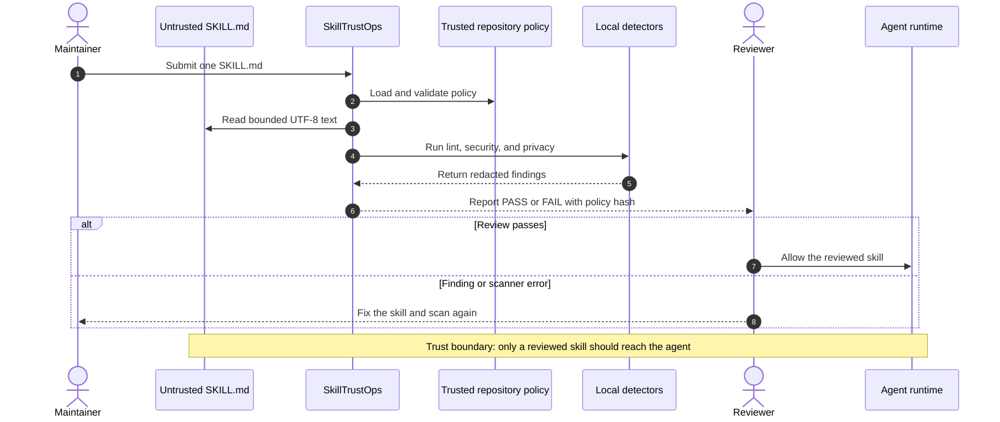
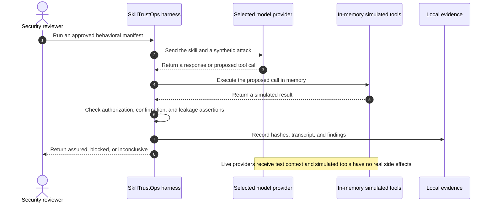

# SkillTrustOps

Local-first trust checks and behavioral security testing for AI agent skills.

## The 40-second explanation

AI agent skills are executable trust decisions written in Markdown. Before a
team loads one, SkillTrustOps recursively inspects every `SKILL.md` in a file or
folder, applies one versioned policy, and produces a deterministic report with
per-skill findings and timings. Structure, exposed secrets, dangerous command
patterns, and common personal data are tested locally without executing the
skill, calling an LLM, or requiring an API key. An opt-in red-team harness then
tests behavioral manifests against simulated tools using either an offline
reference target or an explicitly configured live model. Reports distinguish a
confirmed failure from missing evidence instead of turning uncertainty into a
pass. The published benchmark locks the exact 605-skill corpus, policy, Docker
limits, raw runs, checksums, and dashboard so anyone can reproduce the evidence
on their own machine.

SkillTrustOps is a pre-trust review gate, not a claim that an agent is universally
safe. Its differentiator is evidence: deterministic offline checks, explicit
assurance boundaries, machine-readable reports, and reproducible resource-bound
benchmarks in one Python package.

## Requirements and installation

SkillTrustOps requires **Python 3.12 or newer**.

```bash
python -m pip install skilltrustops
skilltrustops --help
```

Until the first PyPI release, install a locally built wheel or the Git repository
instead. The package exposes both the `skilltrustops` CLI and `skilltrustops.scan`
Python API.

| Capability | Network or OpenAI key required? |
| --- | --- |
| Recursive lint, security, and privacy scan | No |
| Docker benchmark reproduction | No after corpus and image inputs are available locally |
| Reference-provider red-team harness validation | No |
| Deterministic red-team manifest generation | No |
| Red-team assessment of a real OpenAI model | Yes |

Offline red-team runs validate the harness, fixtures, attack assertions, evidence
format, and deterministic reference behavior. They do **not** establish how an
unqueried production model will behave.

## Catch unsafe skill instructions before an agent follows them

Run the first trust check in three commands:

```bash
uv sync --extra dev
uv run skilltrustops policy init --profile recommended-v2
uv run skilltrustops lint path/to/SKILL.md && uv run skilltrustops security path/to/SKILL.md && uv run skilltrustops privacy path/to/SKILL.md
```

You get a local, deterministic pass or fail for skill structure, exposed
credentials, dangerous instructions, and personal data. Start with
[Getting started](docs/getting-started.md) for installation alternatives and
behavioral testing.

## Scan one skill or a folder

Apply one policy to every `SKILL.md` below a folder and report deterministic
per-skill timings:

```bash
uv run skilltrustops scan path/to/skills \
  --policy skilltrustops.yaml \
  --format json > skilltrustops-report.json
```

The same stable report is available from Python:

```python
from skilltrustops import scan

report = scan("path/to/skills", policy_path="skilltrustops.yaml")
for skill in report.skills:
    print(skill.relative_path, skill.status, skill.duration_ms)
```

Folder discovery is recursive, deterministic, and limited to regular,
non-symlink files named `SKILL.md`. A failed skill produces findings while a
scanner failure is reported separately as an error; errors are never counted as
passes.

> [!IMPORTANT]
> Static checks never execute the submitted skill or upload its content.
> Red-team runs call the model provider you select. All tools used by the
> red-team harness are in-memory simulations and perform no real side effects.

## Three gates to trust

SkillTrustOps evaluates a skill in three stages: structure, security and
privacy, then model behavior under attack.

[](docs/images/skilltrustops-three-gates.png)

## Run individual checks

```bash
uv run skilltrustops policy validate
uv run skilltrustops lint examples/valid-skill/SKILL.md
uv run skilltrustops security examples/valid-skill/SKILL.md
uv run skilltrustops privacy examples/valid-skill/SKILL.md
```

`policy init` creates `skilltrustops.yaml` in the repository root and never
overwrites an existing file.

[](docs/images/skilltrustops-command-reference.png)

### What the security scan checks

`skilltrustops security` reads one `SKILL.md` locally and checks it for exposed
credentials, private keys, dynamic Python execution, shell invocation,
destructive removal commands, and downloads piped directly to a shell. It does
not execute the skill, and all matched secret values are redacted from output.

See [Security scan](docs/security-scan.md) for the complete rule list, execution
flow, configuration, and scope limits.

## Agent-to-Skill trust boundary

SkillTrustOps is a pre-trust review gate. It evaluates an untrusted skill before
a reviewer allows an agent runtime to load it; it is not an inline production
proxy.

### Static review stays local



### Red-team testing uses simulated tools



## Red-team a skill

Create and review a behavioral test manifest, then run it:

```bash
uv run skilltrustops redteam init path/to/SKILL.md \
  --provider deterministic

# Review path/to/skilltrust-package.yaml before relying on the result.

uv run skilltrustops redteam run path/to/SKILL.md \
  --provider reference \
  --model resistant-demo
```

Use the reference provider to learn and validate the workflow without a network
connection. For a live OpenAI assessment, configure `OPENAI_API_KEY` in an
uncommitted repository `.env`, generate or review the manifest, and run with
`--provider openai`.

```bash
uv run skilltrustops redteam run path/to/SKILL.md \
  --provider openai \
  --model <approved-model-id>
```

Red-team testing is opt-in: running `redteam run` turns it on for that
assessment. There is no `redteam.enabled` policy field. The `redteam` policy
section configures sandbox behavior.

## Documentation

| Guide | Use it when you need to… |
| --- | --- |
| [Documentation home](docs/README.md) | Find the right guide and understand the trust model. |
| [Getting started](docs/getting-started.md) | Install SkillTrustOps and complete a first assessment. |
| [Policy guide](docs/policy-guide.md) | Create, validate, discover, and maintain `skilltrustops.yaml`. |
| [Policy reference](docs/policy-reference.md) | Look up every supported policy field and constraint. |
| [Security scan](docs/security-scan.md) | Understand secret and dangerous-instruction checks, execution flow, and limits. |
| [Red-team testing](docs/red-team-testing.md) | Decide when to test, activate it, review manifests, and interpret evidence. |
| [Security best practices](docs/security-best-practices.md) | Operate SkillTrustOps safely in development and CI. |
| [Troubleshooting](docs/troubleshooting.md) | Resolve common policy, provider, sandbox, and exit-code failures. |

## What the decisions mean

| Decision | Meaning |
| --- | --- |
| `assured` | Every applicable case passed for the exact approved package, model, harness, sandbox boundary, and attack definitions recorded in evidence. |
| `blocked` | At least one deterministic assertion confirmed a security failure. |
| `inconclusive` | Required evidence was missing or uncertain, a draft was unapproved, or the configured isolation boundary was non-certifying. |

`assured` is scoped evidence, not a universal safety guarantee. Never convert
`inconclusive` into a pass.

## Development

```bash
uv run --extra dev pytest
uv run --extra dev ruff check .
uv run --extra dev mypy src
uv build
```

## License

Apache-2.0. See the package metadata in [`pyproject.toml`](pyproject.toml).
