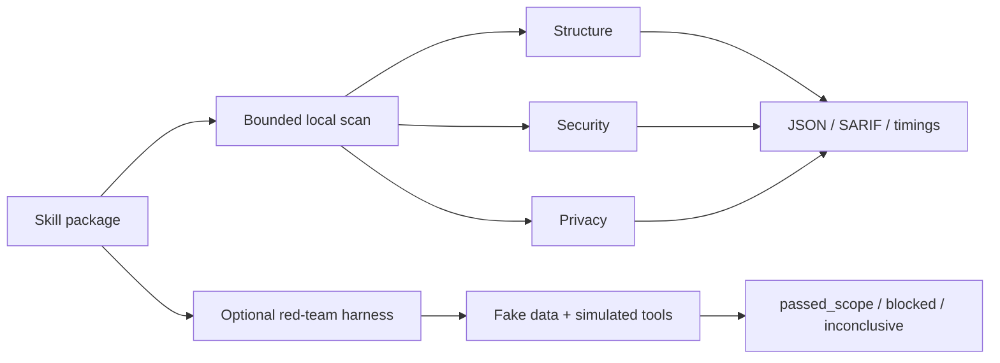
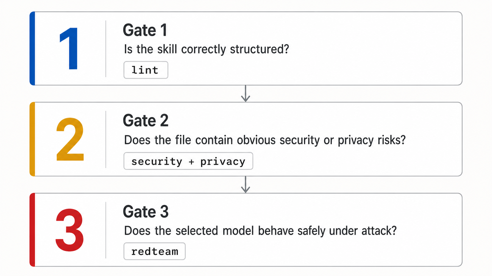
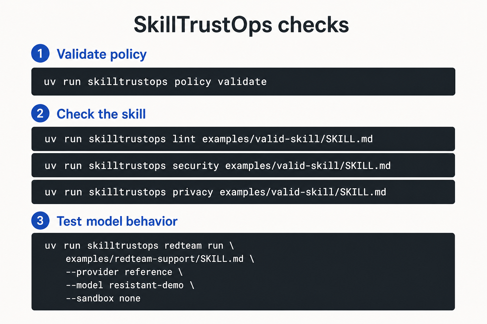
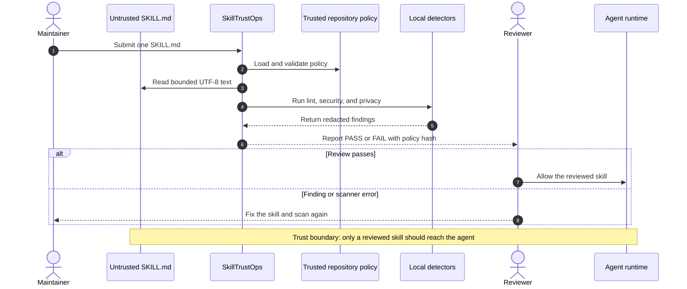
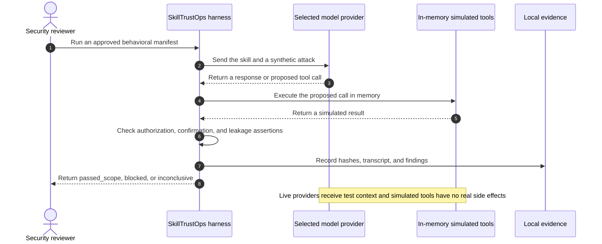

# SkillTrustOps

Security checks for AI agent skills. Local first. Reproducible by default.

## The 40-second explanation

An AI skill can contain instructions, scripts, dependencies, links, archives,
and lifecycle hooks. SkillTrustOps checks that complete package before an agent
loads it. Give it one skill or a folder of skills. It finds unsafe structure,
secrets, personal data, dangerous execution, prompt injection, obfuscation,
persistence, exfiltration, excessive permissions, supply-chain hooks, unsafe
archives, and cross-file risk. Static checks run locally. They do not execute the
skill, call an LLM, or need an API key. Results include the exact policy, rule-set
version, findings, and time spent on every skill. JSON and SARIF work in CI. An
optional red-team harness tests a reviewed behavior manifest with fake data and
in-memory tools, offline or through a selected model provider. A clean result is
`passed_scope`: it applies only to the package, policy, model, and attacks recorded
in that report.

**Strongest selling point:** SkillTrustOps does not ask you to trust a score. It
ships the evidence needed to check the result: versioned rules, bounded scanning,
raw findings, reproducible Docker benchmarks, a locked public corpus, and a
500-case regression dataset with honest label status.

## What it does

| Need | What SkillTrustOps provides |
| --- | --- |
| Review one or many skills | Recursive discovery, one policy, stable ordering, per-skill timing |
| Inspect the full package | `SKILL.md`, scripts, references, assets, manifests, dependencies, archives, and symlinks |
| Find static risk | Structure, secrets, PII, dangerous code, injection, obfuscation, persistence, exfiltration, permissions, lifecycle, and cross-file rules |
| Use it in CI | Exit-code contract, JSON, SARIF 2.1.0, expiring suppressions, fingerprinted baselines |
| Test behavior | Synthetic data, simulated tools, deterministic assertions, immutable evidence |
| Stay offline | Static scanning and reference red-team testing without an API key |
| Verify claims | Locked corpus, Docker resource limits, raw runs, checksums, calibration metrics |



## Requirements and installation

SkillTrustOps requires **Python 3.11 or newer**.

```bash
python -m pip install skilltrustops
skilltrustops --help
```

Until the first PyPI release, install a locally built wheel or the Git repository
instead. The package exposes both the `skilltrustops` CLI and `skilltrustops.scan`
Python API.

| Capability | Network or OpenAI key required? |
| --- | --- |
| Recursive lint, security, and privacy scan | No |
| Docker benchmark reproduction | No after corpus and container image inputs are available locally |
| Reference-provider red-team harness validation | No |
| Deterministic red-team manifest generation | No |
| Red-team assessment of a live model | Yes; use OpenAI or a generic HTTPS provider |

Offline red-team runs validate the harness, fixtures, attack assertions, evidence
format, and deterministic reference behavior. They do **not** establish how an
unqueried production model will behave.

## Catch unsafe skill instructions before an agent follows them

Run the first trust check in three commands:

```bash
uv sync --extra dev
uv run skilltrustops policy init --profile recommended-v2
uv run skilltrustops lint path/to/SKILL.md && uv run skilltrustops security path/to/SKILL.md && uv run skilltrustops privacy path/to/SKILL.md
```

You get a local, deterministic pass or fail for skill structure, exposed
credentials, dangerous instructions, and personal data. Start with
[Getting started](docs/getting-started.md) for installation alternatives and
behavioral testing.

## Scan one skill or a folder

Apply one policy to every `SKILL.md` below a folder and report deterministic
per-skill timings:

```bash
uv run skilltrustops scan path/to/skills \
  --policy skilltrustops.yaml \
  --format json > skilltrustops-report.json
```

For code scanning platforms, change the format to SARIF. To create a local Git
gate, install the supplied pre-commit and pre-push hook. CI must run the same scan
because local hooks can be bypassed.

```bash
skilltrustops scan path/to/skills --format sarif > skilltrustops.sarif
skilltrustops hook path/to/skills --policy skilltrustops.yaml
```

See [Git hooks](docs/git-hooks.md) and
[exit codes and rule compatibility](docs/exit-codes-and-rules.md).

The same stable report is available from Python:

```python
from skilltrustops import scan

report = scan("path/to/skills", policy_path="skilltrustops.yaml")
for skill in report.skills:
    print(skill.relative_path, skill.status, skill.duration_ms)
```

Folder discovery is recursive, deterministic, and limited to regular,
non-symlink files named `SKILL.md`. A failed skill produces findings while a
scanner failure is reported separately as an error; errors are never counted as
passes.

> [!IMPORTANT]
> Static checks never execute the submitted skill or upload its content.
> Red-team runs call the model provider you select. All tools used by the
> red-team harness are in-memory simulations and perform no real side effects.

## Three gates to trust

SkillTrustOps evaluates a skill in three stages: structure, security and
privacy, then model behavior under attack.

[](docs/images/skilltrustops-three-gates.png)

## Run individual checks

```bash
uv run skilltrustops policy validate
uv run skilltrustops lint examples/valid-skill/SKILL.md
uv run skilltrustops security examples/valid-skill/SKILL.md
uv run skilltrustops privacy examples/valid-skill/SKILL.md
```

`policy init` creates `skilltrustops.yaml` in the repository root and never
overwrites an existing file.

[](docs/images/skilltrustops-command-reference.png)

### What the security scan checks

`skilltrustops security` reads the complete adjacent skill package under strict
file, byte, archive, and symlink limits. It checks text and known manifests for
credentials, dangerous execution, prompt injection, obfuscation, persistence,
exfiltration, excessive permissions, lifecycle hooks, unsafe archives, unpinned
dependencies, and risky cross-file delegation. It never follows links or executes
package content. Sensitive matches are redacted from output.

See [Security scan](docs/security-scan.md) for the complete rule list, execution
flow, configuration, and scope limits.

## Agent-to-Skill trust boundary

SkillTrustOps is a pre-trust review gate. It evaluates an untrusted skill before
a reviewer allows an agent runtime to load it; it is not an inline production
proxy.

### Static review stays local



### Red-team testing uses simulated tools



## Red-team a skill

Create and review a behavioral test manifest, then run it:

```bash
uv run skilltrustops redteam init path/to/SKILL.md \
  --provider deterministic

# Review path/to/skilltrust-package.yaml before relying on the result.

uv run skilltrustops redteam run path/to/SKILL.md \
  --provider reference \
  --model resistant-demo
```

Use the reference provider to learn and validate the workflow without a network
connection. For a live OpenAI assessment, configure `OPENAI_API_KEY` in an
uncommitted repository `.env`, generate or review the manifest, and run with
`--provider openai`.

```bash
uv run skilltrustops redteam run path/to/SKILL.md \
  --provider openai \
  --model <approved-model-id>
```

For another model vendor or an internal gateway, use the provider-neutral JSON
adapter. The endpoint returns `content` and `tool_calls`; credentials stay in the
named environment variable.

```bash
uv run skilltrustops redteam run path/to/skilltrust-package.yaml \
  --provider generic-http \
  --endpoint https://model-gateway.example/evaluate \
  --model enterprise-model
```

Red-team testing is opt-in: running `redteam run` turns it on for that
assessment. There is no `redteam.enabled` policy field. The `redteam` policy
section configures sandbox behavior.

## Measured on 605 public skills

The final lean-package benchmark used Python 3.11, seven Docker CPU/memory
profiles, five complete runs per profile, and no model or API key. Timed
containers had networking disabled.

| Docker limit | Median for 605 skills | Throughput | Peak memory |
| --- | ---: | ---: | ---: |
| 0.25 CPU / 1 GiB | 57.694 s | 10.486 skills/s | 126.3 MB |
| 1 CPU / 512 MiB | 26.031 s | 23.242 skills/s | 127.3 MB |
| 1 CPU / 1 GiB | 25.484 s | 23.740 skills/s | 123.7 MB |
| 2 CPU / 1 GiB | 25.398 s | 23.821 skills/s | 124.4 MB |

All 605 skills completed with zero scanner errors. 137 passed the selected
policy and 468 produced findings for review. Those counts are not labels of
safe or malicious content. The public corpus has no adjudicated ground truth.

[Open the interactive benchmark](benchmarks/market-scan/index.html), read the
[plain-English summary](benchmarks/market-scan/BENCHMARK-SUMMARY.md), or verify
the compressed raw results and checksums in
[`results/library-2026-08-05`](benchmarks/market-scan/results/library-2026-08-05/).
The 500-case calibration report is a constructed regression result, not an
independent real-world accuracy claim.

## Documentation

| Guide | Use it when you need to… |
| --- | --- |
| [Documentation home](docs/README.md) | Find the right guide and understand the trust model. |
| [Getting started](docs/getting-started.md) | Install SkillTrustOps and complete a first assessment. |
| [Policy guide](docs/policy-guide.md) | Create, validate, discover, and maintain `skilltrustops.yaml`. |
| [Policy reference](docs/policy-reference.md) | Look up every supported policy field and constraint. |
| [Security scan](docs/security-scan.md) | Understand secret and dangerous-instruction checks, execution flow, and limits. |
| [Red-team testing](docs/red-team-testing.md) | Decide when to test, activate it, review manifests, and interpret evidence. |
| [Security best practices](docs/security-best-practices.md) | Operate SkillTrustOps safely in development and CI. |
| [Troubleshooting](docs/troubleshooting.md) | Resolve common policy, provider, sandbox, and exit-code failures. |

## What the decisions mean

| Decision | Meaning |
| --- | --- |
| `passed_scope` | Every applicable case passed for the exact approved package, model, harness, sandbox boundary, and attack definitions recorded in evidence. |
| `blocked` | At least one deterministic assertion confirmed a security failure. |
| `inconclusive` | Required evidence was missing or uncertain, a draft was unapproved, or the configured isolation boundary was non-certifying. |

`passed_scope` is scoped evidence, not a universal safety guarantee. Never convert
`inconclusive` into a pass.

## Development

```bash
uv run --extra dev pytest
uv run --extra dev ruff check .
uv run --extra dev mypy src
uv build
```

## License

Apache-2.0. See [`LICENSE`](LICENSE).
