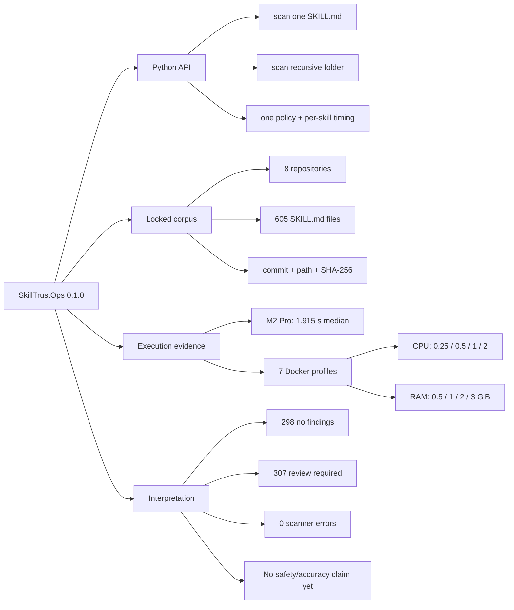

# SkillTrustOps benchmark summary

## One-screen result

| Question | Evidence |
| --- | --- |
| Does folder scanning work? | 605 recursively discovered skills, one policy, zero scanner errors |
| Is the corpus reproducible? | 8 repositories at immutable commits; 605 per-skill hashes; combined lock `58525efe…96f4b` |
| Is local scanning fast? | M2 Pro median 1.915 s total; 315.93 skills/s; 2.591 ms p50 per skill |
| Does it run in a small container? | Yes: all 605 completed at 0.25 CPU/1 GiB and 1 CPU/512 MiB |
| Practical small profile | 1 CPU/512 MiB: median 5.574 s, 108.532 skills/s, under 61 MB peak cgroup memory |
| Best measured profile | 2 CPU/1 GiB: median 4.848 s, 124.784 skills/s |
| Do more CPU/RAM scale linearly? | No. Current scanner is sequential; >1 CPU and >512 MiB show limited/no reliable gain |
| Are 307 skills unsafe? | No. They had review findings; results are not adjudicated security ground truth |
| Can accuracy be claimed? | Not yet; requires the independently labeled 500-case dataset |

## Evidence map

## Docker comparison

| Controlled profile | Median for 605 | Throughput | p95/skill | Peak memory |
| --- | ---: | ---: | ---: | ---: |
| 0.25 CPU / 1 GiB | 10.621 s | 56.962/s | 78.483 ms | 70.8 MB |
| 0.50 CPU / 1 GiB | 5.740 s | 105.395/s | 46.788 ms | 49.9 MB |
| 1 CPU / 512 MiB | 5.574 s | 108.532/s | 14.520 ms | 61.0 MB |
| 1 CPU / 1 GiB | 5.309 s | 113.962/s | 11.180 ms | 57.6 MB |
| 1 CPU / 2 GiB | 5.534 s | 109.322/s | 13.219 ms | 50.5 MB |
| 1 CPU / 3 GiB | 6.476 s | 93.428/s | 13.697 ms | 57.2 MB |
| 2 CPU / 1 GiB | 4.848 s | 124.784/s | 11.025 ms | 49.1 MB |

Five runs were performed per profile. Profile order was sequential and other
Docker workloads were active on the development machine, so small differences
among the 1–3 GiB profiles are noise, not evidence that more memory is slower.
The publication-grade rerun should use an otherwise idle dedicated runner,
interleave profile order, and include confidence intervals.

## How to inspect from broadest to deepest

1. Read this file for the decision summary.
2. Read `analysis.md` for engineering and market implications.
3. Read `results/docker/SUMMARY.md` for exact cgroup values.
4. Verify `results/docker/ARTIFACTS.sha256`.
5. Decompress any `results/docker/*.json.gz` for every run, skill, check,
   finding, and timing.
6. Use `corpus.lock.json` and `sources.yaml` to reconstruct inputs.

